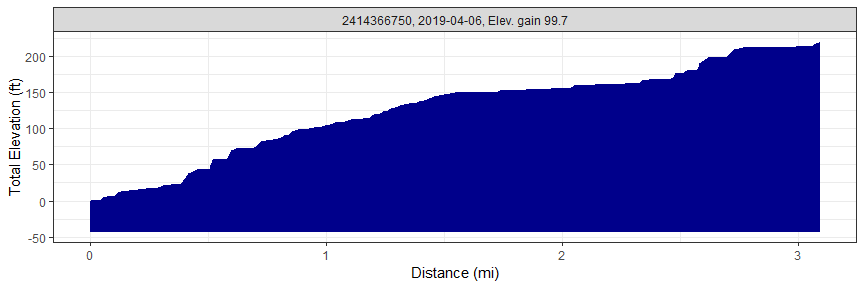
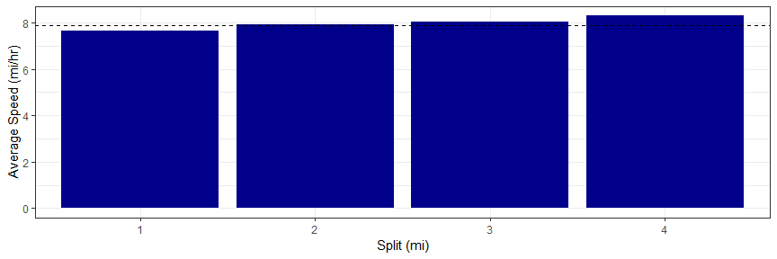
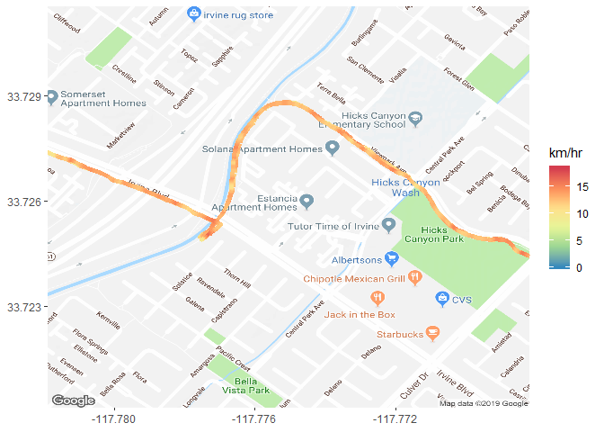
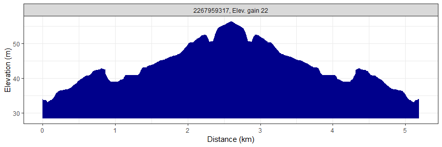
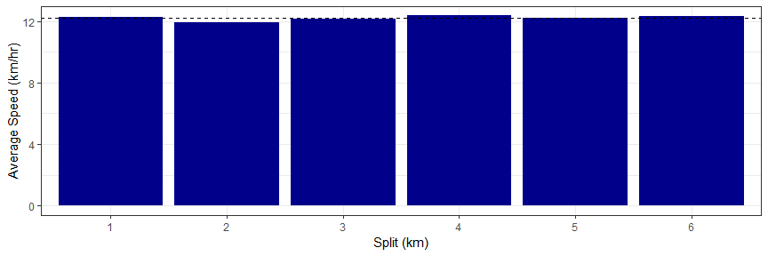

---
output:
  html_document:
    keep_md: yes
    toc: no
    self_contained: yes
---

# rStrava

##### *Marcus W. Beck, mbafs2012@gmail.com, Pedro Villarroel, pedrodvf@gmail.com, Daniel Padfield, dp323@exeter.ac.uk, Lorenzo Gaborini, lorenzo.gaborini@unil.ch, Niklas von Maltzahn, niklasvm@gmail.com*

Linux: [](https://travis-ci.org/fawda123/rStrava)

Windows: [](https://ci.appveyor.com/project/fawda123/rStrava)

[](https://zenodo.org/badge/latestdoi/23404183)


### Overview and installation

This is the development repository for rStrava, an R package to access data from the Strava API.  The package can be installed and loaded as follows:


```r
install.packages('devtools')
devtools::install_github('fawda123/rStrava')
```

### Issues and suggestions

Please report any issues and suggestions on the [issues link](https://github.com/fawda123/rStrava/issues) for the repository.

### Package overview

The functions are in two categories depending on mode of use.  The first category of functions scrape data from the public Strava website and the second category uses the API functions or relies on data from the API functions.  The second category requires an authentication token.  The help files for each category can be viewed using ```help.search```:


```r
help.search('notoken', package = 'rStrava')
help.search('token', package = 'rStrava')
```

### Scraping functions (no token)

An example using the scraping functions is below. Some users may have privacy settings that block public access to account data.


```r
# get athlete data 
athl_fun(2837007, trace = FALSE)
```

```
## $`2837007`
## $`2837007`$name
## [1] "Marcus Beck"
## 
## $`2837007`$location
## [1] "Irvine, California"
## 
## $`2837007`$units
## [1] "mi" "ft"
## 
## $`2837007`$monthly
##        month     miles hours elev_gain
## 1 2018-12-01 161.58634    14       964
## 2 2019-01-01 391.10905    28      1110
## 3 2019-02-01 247.53005    18       679
## 4 2019-03-01 343.69594    24      1039
## 5 2019-04-01 332.47584    23       990
## 6 2019-05-01 351.16172    25      1266
## 7 2019-06-01  15.70267     1        83
## 
## $`2837007`$recent
##           id           name type startDateLocal distance elevation
## 1 2420187776   Morning Ride ride     2019-06-02     10.6        51
## 2 2419088213  Afternoon Run  run     2019-06-02      5.0       223
## 3 2419088214 Afternoon Ride ride     2019-05-31     10.8       117
##   movingTime
## 1      39:40
## 2      36:55
## 3      41:44
## 
## $`2837007`$achievements
##                      description             timeago
## 1 2nd best estimated 400m effort 2019-05-22 22:43:09
## 2           PR on Trailwood down 2019-06-02 23:19:02
## 3   PR on State Street Ramp Down 2019-05-23 13:36:00
## 4      PR on Capital Hill Repeat 2019-05-23 13:36:00
## 5        PR on State Street Ramp 2019-05-23 13:36:00
```

### API functions (token)

#### Setup 

These functions require a Strava account and a personal API, both of which can be obtained on the Strava website.  The user account can be created by following instructions on the [Strava homepage](https://www.strava.com/).  After the account is created, a personal API can be created under API tab of [profile settings](https://www.strava.com/settings/api).  The user must have an application name (chosen by the user), client id (different from the athlete id), and an application secret to create the authentication token.  Additional information about the personal API can be found [here](https://strava.github.io/api/).  Every API retrieval function in the rStrava package requires an authentication token (called `stoken` in the help documents).  The following is a suggested workflow for using the API functions with rStrava.

First, create the authentication token using your personal information from your API.  Replace the `app_name`, `app_client_id`, and `app_secret` objects with the relevant info from your account.

```r
app_name <- 'myappname' # chosen by user
app_client_id  <- 'myid' # an integer, assigned by Strava
app_secret <- 'xxxxxxxx' # an alphanumeric secret, assigned by Strava

# create the authentication token
stoken <- httr::config(token = strava_oauth(app_name, app_client_id, app_secret))
```

Setting `cache = TRUE` for `strava_oauth` will create an authentication file in the working directory. This can be used in later sessions as follows:

```r
stoken <- httr::config(token = readRDS('.httr-oauth')[[1]])
```

Finally, the `get_heat_map` and `get_elev_prof` functions optionally retrieve elevation data from the Google Maps Elevation API. To use these features, an additional authentication key is required.  Follow the instructions [here](https://developers.google.com/maps/documentation/elevation/#api_key).  The key can be added to the R environment file for later use:


```r
# save the key, do only once
cat("google_key=XXXXXXXXXXXXXXXXXXXXXXXXXXXXXXXXXXXXXX\n",
    file=file.path(normalizePath("~/"), ".Renviron"),
    append=TRUE)

# retrieve the key, restart R if not found
mykey <- Sys.getenv("google_key")
```

The `get_heat_map` function uses [ggmap](https://github.com/dkahle/ggmap) to create base maps.  A Google API key is needed if using any map services where `source = "google"` for the argument to `get_heat_map`.  The same key used for the Elevation API can be used but must be registered externally with the ggmap package using `register_google()` before executing `get_heat_map`.


```r
library(ggmap)
register_google(mykey)
```

#### Using the functions

The API retrieval functions are used with the token.

```r
myinfo <- get_athlete(stoken, id = '2837007')
head(myinfo)
```

```
## $id
## [1] 2837007
## 
## $username
## [1] "beck_marcus"
## 
## $resource_state
## [1] 3
## 
## $firstname
## [1] "Marcus"
## 
## $lastname
## [1] "Beck"
## 
## $city
## [1] "Irvine"
```

An example creating a heat map of activities:

```r
library(dplyr)

# get activities, get activities by lat/lon, plot
my_acts <- get_activity_list(stoken)
act_data <- compile_activities(my_acts) %>% 
	filter(start_longitude < -86.5 & start_longitude > -88.5) %>% 
	filter(start_latitude < 31.5 & start_latitude > 30)
get_heat_map(act_data, col = 'darkgreen', size = 2, distlab = F, f = 0.4)
```

<!-- -->

Plotting elevation and grade for a single ride:

```r
# plot elevation along a single ride
get_heat_map(my_acts, acts = 1, alpha = 1, add_elev = T, f = 0.3, key = mykey, size = 2, col = 'Spectral', maptype = 'satellite', units = 'imperial')
```

<!-- -->

```r
# plot % gradient along a single ride
get_heat_map(my_acts, acts = 1, alpha = 1, add_elev = T, f = 0.3, as_grad = T, key = mykey, size = 2, col = 'Spectral', expand = 5, maptype = 'satellite', units = 'imperial')
```

<!-- -->

Get elevation profiles for activities:

```r
# get activities
my_acts <- get_activity_list(stoken) 

get_elev_prof(my_acts, acts = 1, key = mykey, units = 'imperial')
```

<!-- -->

```r
get_elev_prof(my_acts, acts = 1, key = mykey, units = 'imperial', total = T)
```

<!-- -->

Plot average speed per split (km or mile) for an activity:

```r
# plots for most recent activity
plot_spdsplits(my_acts, stoken, acts = 1, units = 'imperial')
```

<!-- -->

Additional functions are provided to get "stream" information for individual activities.  Streams provide detailed information about location, time, speed, elevation, gradient, cadence, watts, temperature, and moving status (yes/no) for an individual activity.

Use `get_activity_streams` for detailed info about activites:

```r
# get streams for the first activity in my_acts
strms_data <- get_activity_streams(my_acts, stoken, acts = 1)
head(strms_data)
```

```
##   altitude distance grade_smooth moving time velocity_smooth      lat
## 1     34.6   0.0000         -1.4  FALSE    0            0.00 33.72592
## 2     34.6   0.0036         -2.0   TRUE    7            1.80 33.72594
## 3     34.5   0.0074         -1.5   TRUE   12            2.16 33.72591
## 4     34.3   0.0149         -0.9   TRUE   14            5.76 33.72584
## 5     34.3   0.0204         -0.4   TRUE   15            7.56 33.72580
## 6     34.4   0.0259          0.9   TRUE   16            9.00 33.72576
##         lng         id
## 1 -117.7833 2420187776
## 2 -117.7834 2420187776
## 3 -117.7834 2420187776
## 4 -117.7834 2420187776
## 5 -117.7833 2420187776
## 6 -117.7833 2420187776
```

Stream data can be plotted using any of the plotting functions.

```r
# heat map
get_heat_map(strms_data, alpha = 1, filltype = 'speed', f = 0.3, size = 2, col = 'Spectral', distlab = F)
```

<!-- -->


```r
# elevation profile
get_elev_prof(strms_data)
```

<!-- -->

```r
# speed splits
plot_spdsplits(strms_data, stoken)
```

<!-- -->

### License

This package is released in the public domain under the creative commons license [CC0](https://tldrlegal.com/license/creative-commons-cc0-1.0-universal). 
