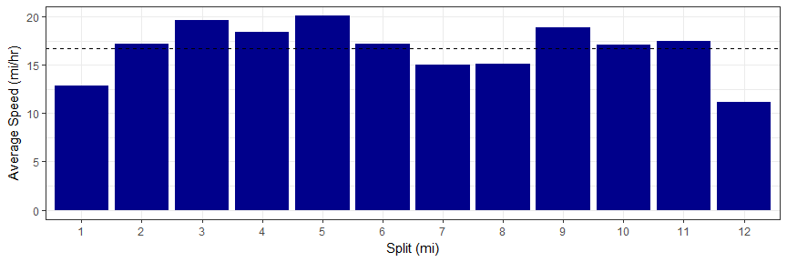

# rStrava

##### *Marcus W. Beck, mbafs2012@gmail.com, Pedro Villarroel, pedrodvf@gmail.com, Daniel Padfield, dp323@exeter.ac.uk*

Linux: [](https://travis-ci.org/fawda123/rStrava)

Windows: [](https://ci.appveyor.com/project/fawda123/rStrava)

[](https://zenodo.org/badge/latestdoi/23404183)


### Overview and installation

This is the development repository for rStrava, an R package to access data from the Strava API.  The package can be installed and loaded as follows:


```r
install.packages('devtools')
devtools::install_github('fawda123/rStrava')
```

### Issues and suggestions

Please report any issues and suggestions on the [issues link](https://github.com/fawda123/rStrava/issues) for the repository.

### Package overview

The functions are in two categories depending on mode of use.  The first category of functions scrape data from the public Strava website and the second category uses the API functions or relies on data from the API functions.  The second category requires an authentication token.  The help files for each category can be viewed using ```help.search```:


```r
help.search('notoken', package = 'rStrava')
help.search('token', package = 'rStrava')
```

### Scraping functions (no token)

An example using the scraping functions:


```r
# get athlete data for these guys
athl_fun(c(2837007, 2527465, 2140248), trace = FALSE)
```

```
## $`2837007`
## $`2837007`$units
## [1] "mi" "h"  "m"  "ft"
## 
## $`2837007`$location
## [1] "Pensacola, FL"
## 
## $`2837007`$current_month
##  Distance      Time Elevation 
##    173.10     12.15   2590.00 
## 
## $`2837007`$monthly
## Sep 2016      Oct      Nov      Dec Jan 2017      Feb      Mar      Apr 
## 450.9711 446.4158 327.9789 400.8632 373.5316 223.2079 378.0868 378.0868 
##      May      Jun      Jul      Aug      Sep 
## 255.0947 318.8684 327.9789 173.1000   0.0000 
## 
## $`2837007`$year_to_date
##       Distance           Time Elevation Gain          Rides 
##         2207.4          145.0        25778.0          189.0 
## 
## $`2837007`$all_time
##  Total Distance      Total Time Total Elev Gain     Total Rides 
##       19682.400        1193.283      138484.000        1474.000 
## 
## 
## $`2527465`
## $`2527465`$units
## [1] "km" "h"  "m"  "m" 
## 
## $`2527465`$location
## [1] "Buenos Aires, Ciudad Autónoma de Buenos Aires, Argentina"
## 
## $`2527465`$current_month
##   Distance       Time  Elevation 
##  207.00000   12.93333 2454.00000 
## 
## $`2527465`$monthly
## Sep 2016      Oct      Nov      Dec Jan 2017      Feb      Mar      Apr 
##   393.30   320.85   538.20  1003.95   548.55   403.65   445.05   186.30 
##      May      Jun      Jul      Aug      Sep 
##     0.00     0.00    62.10   238.05   207.00 
## 
## $`2527465`$year_to_date
##       Distance           Time Elevation Gain          Rides 
##      2122.8000       113.8833     13398.0000        79.0000 
## 
## $`2527465`$all_time
##  Total Distance      Total Time Total Elev Gain     Total Rides 
##      16433.4000        903.0333     184354.0000        583.0000 
## 
## 
## $`2140248`
## $`2140248`$units
## [1] "km" "h"  "m"  "m" 
## 
## $`2140248`$location
## [1] "Falmouth, England, United Kingdom"
## 
## $`2140248`$current_month
##   Distance       Time  Elevation 
##  308.20000   15.88333 4819.00000 
## 
## $`2140248`$monthly
##  Sep 2016       Oct       Nov       Dec  Jan 2017       Feb       Mar 
##  54.38824 374.67451   0.00000   0.00000 271.94118  84.60392  72.51765 
##       Apr       May       Jun       Jul       Aug       Sep 
## 302.15686 284.02745 181.29412 429.06275 555.96863 308.20000 
## 
## $`2140248`$year_to_date
##       Distance           Time Elevation Gain          Rides 
##     2064.20000       85.71667    28660.00000       94.00000 
## 
## $`2140248`$all_time
##  Total Distance      Total Time Total Elev Gain     Total Rides 
##          9020.1           380.5        113503.0           574.0
```

### API functions (token)

#### Setup 

These functions require a Strava account and a personal API, both of which can be obtained on the Strava website.  The user account can be created by following instructions on the [Strava homepage](https://www.strava.com/).  After the account is created, a personal API can be created under API tab of [profile settings](https://www.strava.com/settings/api).  The user must have an application name (chosen by the user), client id (different from the athlete id), and an application secret to create the authentication token.  Additional information about the personal API can be found [here](https://strava.github.io/api/).  Every API retrieval function in the rStrava package requires an authentication token (called `stoken` in the help documents).  The following is a suggested workflow for using the API functions with rStrava.

First, create the authentication token using your personal information from your API.  Replace the `app_name`, `app_client_id`, and `app_secret` objects with the relevant info from your account.

```r
app_name <- 'myappname' # chosen by user
app_client_id  <- 'myid' # an integer, assigned by Strava
app_secret <- 'xxxxxxxx' # an alphanumeric secret, assigned by Strava

# create the authentication token
stoken <- httr::config(token = strava_oauth(app_name, app_client_id, app_secret))
```

Setting `cache = TRUE` for `strava_oauth` will create an authentication file in the working directory. This can be used in later sessions as follows:

```r
stoken <- httr::config(token = readRDS('.httr-oauth')[[1]])
```

Finally, the `get_heat_map` and `get_elev_prof` functions optionally retrieve elevation data from the Google Maps Elevation API. To use these features, an additional authentication key is required.  Follow the instructions [here](https://developers.google.com/maps/documentation/elevation/#api_key).  The key can be added to the R environment file for later use:


```r
# save the key, do only once
cat("google_key=XXXXXXXXXXXXXXXXXXXXXXXXXXXXXXXXXXXXXX\n",
    file=file.path(normalizePath("~/"), ".Renviron"),
    append=TRUE)

# retrieve the key, restart R if not found
mykey <- Sys.getenv("google_key")
```

#### Using the functions

The API retrieval functions are used with the token.


```r
myinfo <- get_athlete(stoken, id = '2837007')
head(myinfo)
```

```
## $id
## [1] 2837007
## 
## $username
## [1] "beck_marcus"
## 
## $resource_state
## [1] 3
## 
## $firstname
## [1] "Marcus"
## 
## $lastname
## [1] "Beck"
## 
## $city
## [1] "Pensacola"
```

An example creating a heat map of activities:

```r
# get activities, get activities by location, plot
my_acts <- get_activity_list(stoken)
acts <- lapply(my_acts, function(x) x$location_city) %in% c('Pensacola', 'Pensacola Beach', 'Milton') 
get_heat_map(my_acts, acts = which(acts), col = 'darkgreen', size = 2, dist = F)
```

<!-- -->

Plotting elevation and grade for a single ride:

```r
# plot elevation along a single ride
get_heat_map(my_acts, acts = 1, alpha = 1, add_elev = T, f = 0.1, key = mykey, size = 2, col = 'Spectral', maptype = 'satellite', units = 'imperial')
```

<!-- -->

```r
# plot % gradient along a single ride
get_heat_map(my_acts, acts = 1, alpha = 1, add_elev = T, f = 0.1, as_grad = T, key = mykey, size = 2, col = 'Spectral', expand = 5, maptype = 'satellite', units = 'imperial')
```

<!-- -->

Get elevation profiles for activities:

```r
# get activities
my_acts <- get_activity_list(stoken) 

get_elev_prof(my_acts, acts = 1, key = mykey, units = 'imperial')
```

<!-- -->

```r
get_elev_prof(my_acts, acts = 1, key = mykey, units = 'imperial', total = T)
```

<!-- -->

Plot average speed per split (km or mile) for an activity:

```r
# plots for most recent activity
get_spdsplits(my_acts, stoken, acts = 1, units = 'imperial')
```

<!-- -->

### License

This package is released in the public domain under the creative commons license [CC0](https://tldrlegal.com/license/creative-commons-cc0-1.0-universal). 
