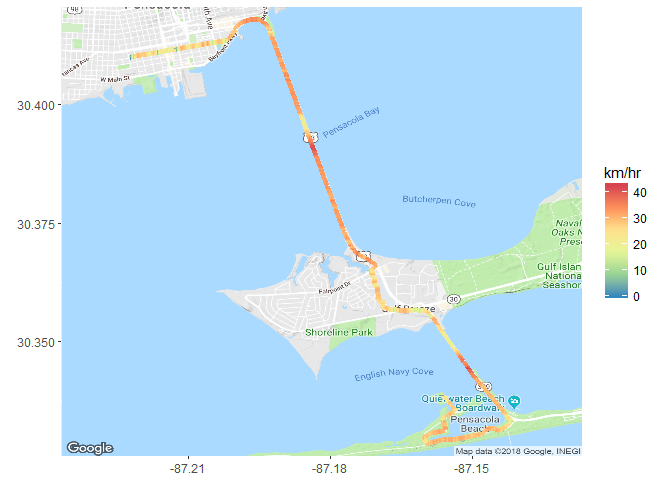
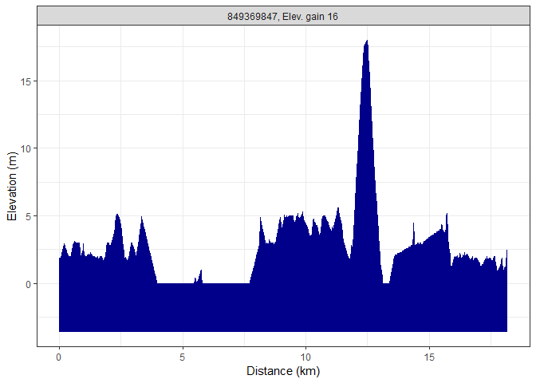
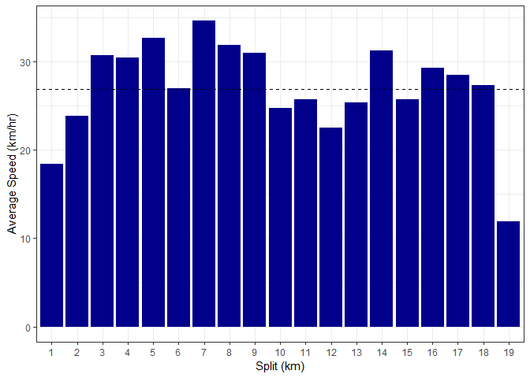

# rStrava

##### *Marcus W. Beck, mbafs2012@gmail.com, Pedro Villarroel, pedrodvf@gmail.com, Daniel Padfield, dp323@exeter.ac.uk, Lorenzo Gaborini, lorenzo.gaborini@unil.ch, Niklas von Maltzahn, niklasvm@gmail.com*

Linux: [](https://travis-ci.org/fawda123/rStrava)

Windows: [](https://ci.appveyor.com/project/fawda123/rStrava)

[](https://zenodo.org/badge/latestdoi/23404183)


### Overview and installation

This is the development repository for rStrava, an R package to access data from the Strava API.  The package can be installed and loaded as follows:


```r
install.packages('devtools')
devtools::install_github('fawda123/rStrava')
```

### Issues and suggestions

Please report any issues and suggestions on the [issues link](https://github.com/fawda123/rStrava/issues) for the repository.

### Package overview

The functions are in two categories depending on mode of use.  The first category of functions scrape data from the public Strava website and the second category uses the API functions or relies on data from the API functions.  The second category requires an authentication token.  The help files for each category can be viewed using ```help.search```:


```r
help.search('notoken', package = 'rStrava')
help.search('token', package = 'rStrava')
```

### Scraping functions (no token)

An example using the scraping functions:


```r
# get athlete data 
athl_fun(2837007, trace = FALSE)
```

```
## $`2837007`
## $`2837007`$units
## [1] "mi" "h"  "m"  "ft"
## 
## $`2837007`$location
## [1] "Irvine, California"
## 
## $`2837007`$current_month
##   Distance       Time  Elevation 
##  60.400000   4.483333 950.000000 
## 
## $`2837007`$monthly
## Aug 2017      Sep      Oct      Nov      Dec Jan 2018      Feb      Mar 
## 173.1467 108.7200 285.8933 225.4933 257.7067 281.8667 297.9733 362.4000 
##      Apr      May      Jun      Jul      Aug 
## 273.8133 306.0267 233.5467 386.5600  60.4000 
## 
## $`2837007`$year_to_date
##       Distance           Time Elevation Gain          Rides 
##      1976.6000       129.4333     25719.0000       185.0000 
## 
## $`2837007`$all_time
##  Total Distance      Total Time Total Elev Gain     Total Rides 
##       22483.600        1377.783      175735.000        1735.000
```

### API functions (token)

#### Setup 

These functions require a Strava account and a personal API, both of which can be obtained on the Strava website.  The user account can be created by following instructions on the [Strava homepage](https://www.strava.com/).  After the account is created, a personal API can be created under API tab of [profile settings](https://www.strava.com/settings/api).  The user must have an application name (chosen by the user), client id (different from the athlete id), and an application secret to create the authentication token.  Additional information about the personal API can be found [here](https://strava.github.io/api/).  Every API retrieval function in the rStrava package requires an authentication token (called `stoken` in the help documents).  The following is a suggested workflow for using the API functions with rStrava.

First, create the authentication token using your personal information from your API.  Replace the `app_name`, `app_client_id`, and `app_secret` objects with the relevant info from your account.

```r
app_name <- 'myappname' # chosen by user
app_client_id  <- 'myid' # an integer, assigned by Strava
app_secret <- 'xxxxxxxx' # an alphanumeric secret, assigned by Strava

# create the authentication token
stoken <- httr::config(token = strava_oauth(app_name, app_client_id, app_secret))
```

Setting `cache = TRUE` for `strava_oauth` will create an authentication file in the working directory. This can be used in later sessions as follows:

```r
stoken <- httr::config(token = readRDS('.httr-oauth')[[1]])
```

Finally, the `get_heat_map` and `get_elev_prof` functions optionally retrieve elevation data from the Google Maps Elevation API. To use these features, an additional authentication key is required.  Follow the instructions [here](https://developers.google.com/maps/documentation/elevation/#api_key).  The key can be added to the R environment file for later use:


```r
# save the key, do only once
cat("google_key=XXXXXXXXXXXXXXXXXXXXXXXXXXXXXXXXXXXXXX\n",
    file=file.path(normalizePath("~/"), ".Renviron"),
    append=TRUE)

# retrieve the key, restart R if not found
mykey <- Sys.getenv("google_key")
```

#### Using the functions

The API retrieval functions are used with the token.


```r
myinfo <- get_athlete(stoken, id = '2837007')
head(myinfo)
```

```
## $id
## [1] 2837007
## 
## $username
## [1] "beck_marcus"
## 
## $resource_state
## [1] 3
## 
## $firstname
## [1] "Marcus"
## 
## $lastname
## [1] "Beck"
## 
## $city
## [1] "Irvine"
```

An example creating a heat map of activities:

```r
library(dplyr)

# get activities, get activities by lat/lon, plot
my_acts <- get_activity_list(stoken)
act_data <- compile_activities(my_acts) %>% 
	filter(start_longitude < -86.5 & start_longitude > -88.5) %>% 
	filter(start_latitude < 31.5 & start_latitude > 30)
get_heat_map(act_data, col = 'darkgreen', size = 2, distlab = F, f = 0.4)
```

<!-- -->

Plotting elevation and grade for a single ride:

```r
# plot elevation along a single ride
get_heat_map(my_acts, acts = 1, alpha = 1, add_elev = T, f = 0.3, key = mykey, size = 2, col = 'Spectral', maptype = 'satellite', units = 'imperial')
```

```
## Coordinate system already present. Adding new coordinate system, which will replace the existing one.
```

<!-- -->

```r
# plot % gradient along a single ride
get_heat_map(my_acts, acts = 1, alpha = 1, add_elev = T, f = 0.3, as_grad = T, key = mykey, size = 2, col = 'Spectral', expand = 5, maptype = 'satellite', units = 'imperial')
```

```
## Coordinate system already present. Adding new coordinate system, which will replace the existing one.
```

<!-- -->

Get elevation profiles for activities:

```r
# get activities
my_acts <- get_activity_list(stoken) 

get_elev_prof(my_acts, acts = 1, key = mykey, units = 'imperial')
```

<!-- -->

```r
get_elev_prof(my_acts, acts = 1, key = mykey, units = 'imperial', total = T)
```

<!-- -->

Plot average speed per split (km or mile) for an activity:

```r
# plots for most recent activity
plot_spdsplits(my_acts, stoken, acts = 1, units = 'imperial')
```

<!-- -->

Additional functions are provided to get "stream" information for individual activities.  Streams provide detailed information about location, time, speed, elevation, gradient, cadence, watts, temperature, and moving status (yes/no) for an individual activity.

Use `get_activity_streams` for detailed info about activites:

```r
# get streams for the first activity in my_acts
strms_data <- get_activity_streams(my_acts, stoken, acts = 1)
head(strms_data)
```

```
##   altitude distance grade_smooth moving time velocity_smooth      lat
## 1      2.2   0.0000         -2.9  FALSE    0            0.00 30.41038
## 2      1.9   0.0067         -2.1  FALSE   60            0.36 30.41002
## 3      1.9   0.0104         -1.5   TRUE   62            0.72 30.41005
## 4      1.9   0.0143          0.0   TRUE   64            0.72 30.41007
## 5      1.9   0.0200          0.0   TRUE   66            7.92 30.41010
## 6      1.9   0.0234          0.0   TRUE   67            9.36 30.41011
##         lng        id
## 1 -87.22191 849369847
## 2 -87.22221 849369847
## 3 -87.22219 849369847
## 4 -87.22216 849369847
## 5 -87.22211 849369847
## 6 -87.22208 849369847
```

Stream data can be plotted using any of the plotting functions.

```r
# heat map
get_heat_map(strms_data, alpha = 1, filltype = 'speed', f = 0.3, size = 2, col = 'Spectral', distlab = F)
```

<!-- -->

```r
# elevation profile
get_elev_prof(strms_data)
```

<!-- -->

```r
# speed splits
plot_spdsplits(strms_data, stoken)
```

<!-- -->

### License

This package is released in the public domain under the creative commons license [CC0](https://tldrlegal.com/license/creative-commons-cc0-1.0-universal). 
