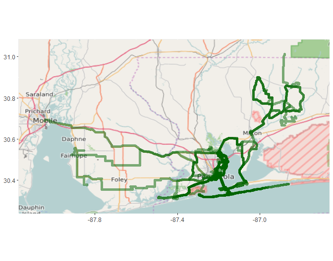
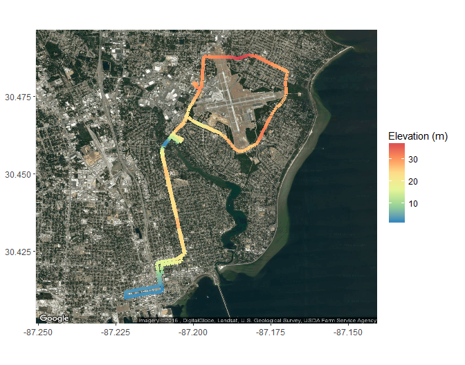
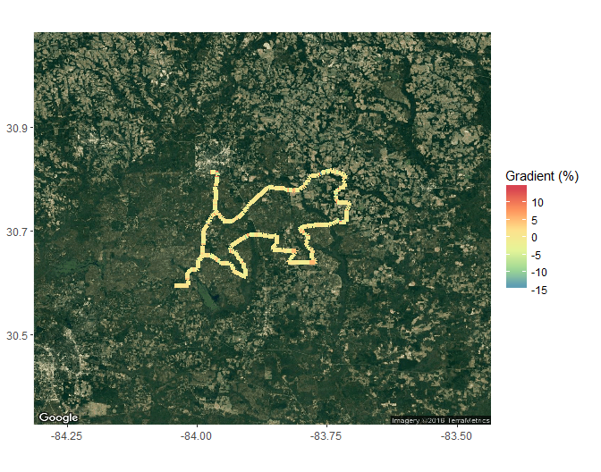
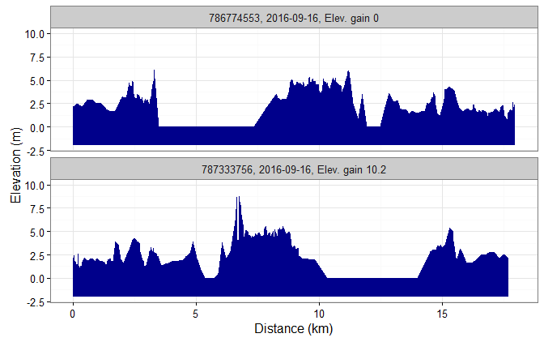
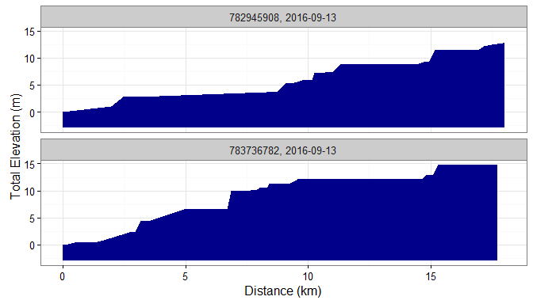

# rStrava

##### *Marcus W. Beck, mbafs2012@gmail.com, Pedro Villarroel, pedrodvf@gmail.com, Daniel Padfield, dp323@exeter.ac.uk*

### Overview and Installation

This is the development repository for rStrava, an R package to access data from the Strava API.  The package can be installed and loaded as follows:


```r
install.packages('devtools')
devtools::install_github('fawda123/rStrava')
```

### Issues and suggestions

Please report any issues and suggestions on the [issues link](https://github.com/fawda123/rStrava/issues) for the repository.

Linux: [](https://travis-ci.org/fawda123/rStrava)

Windows: [](https://ci.appveyor.com/project/fawda123/rStrava)

### Package overview

The functions are in three categories depending on mode of use.  The first category of functions scrape data from the public Strava website and the second category uses the API functions or relies on data from the API functions.  The second category requires an authentication token.  The help files for each category can be viewed using ```help.search```:


```r
help.search('notoken', package = 'rStrava')
help.search('token', package = 'rStrava')
```

#### Scraping functions (no token)

An example using the scraping functions:


```r
# get athlete data for these guys
athl_fun(c(2837007, 2527465, 2140248), trace = FALSE)
```

```
## $`2837007`
## $`2837007`$units
## [1] "mi" "h"  "m"  "ft"
## 
## $`2837007`$location
## [1] "Pensacola, FL"
## 
## $`2837007`$current_month
##  Distance      Time Elevation 
##     216.4      14.6    1386.0 
## 
## $`2837007`$monthly
## Sep 2015      Oct      Nov      Dec Jan 2016      Feb      Mar      Apr 
## 544.4903 684.1032 425.8194 397.8968 439.7806 342.0516 460.7226 460.7226 
##      May      Jun      Jul      Aug      Sep 
## 362.9935 460.7226 467.7032 321.1097 216.4000 
## 
## $`2837007`$year_to_date
##       Distance           Time Elevation Gain          Rides 
##        3376.60         209.85       18848.00         257.00 
## 
## $`2837007`$all_time
##  Total Distance      Total Time Total Elev Gain     Total Rides 
##        16136.70          957.65       103383.00         1175.00 
## 
## 
## $`2527465`
## $`2527465`$units
## [1] "km" "h"  "m"  "m" 
## 
## $`2527465`$location
## [1] "Caracas, Distrito Metropolitano de Caracas, Venezuela"
## 
## $`2527465`$current_month
##  Distance      Time Elevation 
## 233.60000  13.33333 853.00000 
## 
## $`2527465`$monthly
##   Sep 2015        Oct        Nov        Dec   Jan 2016        Feb 
##   50.05714  300.34286  266.97143  383.77143   33.37143  183.54286 
##        Mar        Apr        May        Jun        Jul        Aug 
##  400.45714  400.45714  650.74286  350.40000  417.14286 1618.51429 
##        Sep 
##  233.60000 
## 
## $`2527465`$year_to_date
##       Distance           Time Elevation Gain          Rides 
##      4385.4000       235.2333     42212.0000       102.0000 
## 
## $`2527465`$all_time
##  Total Distance      Total Time Total Elev Gain     Total Rides 
##      12249.3000        668.6833     161874.0000        438.0000 
## 
## 
## $`2140248`
## $`2140248`$units
## [1] "km" "h"  "m"  "m" 
## 
## $`2140248`$location
## [1] "Falmouth, England, United Kingdom"
## 
## $`2140248`$current_month
##  Distance      Time Elevation 
##      0.00      0.65      0.00 
## 
## $`2140248`$monthly
## Sep 2015      Oct      Nov      Dec Jan 2016      Feb      Mar      Apr 
##        0        0        0        0        0        0        0        0 
##      May      Jun      Jul      Aug      Sep 
##        0        0        0        0        0 
## 
## $`2140248`$year_to_date
##       Distance           Time Elevation Gain          Rides 
##     1992.40000       83.13333    23422.00000       70.00000 
## 
## $`2140248`$all_time
##  Total Distance      Total Time Total Elev Gain     Total Rides 
##       6531.2000        277.0333      79752.0000        471.0000
```

#### API functions (token)

These functions require a Strava account and a personal API, both of which can be obtained on the Strava website.  The user account can be created by following instructions on the [Strava homepage](https://www.strava.com/).  After the account is created, a personal API can be created under API tab of [profile settings](https://www.strava.com/settings/api).  The user must have an application name (chosen by the user), client id (different from the athlete id), and an application secret to create the authentication token.  Additional information about the personal API can be found [here](https://strava.github.io/api/).  Every API retrieval function in the rStrava package requires an authentication token (called `stoken` in the help documents).  The following is a suggested workflow for using the API functions with rStrava.

First, create the authentication token using your personal information from your API.  Replace the `app_name`, `app_client_id`, and `app_secret` objects with the relevant info from your account.

```r
app_name <- 'myappname' # chosen by user
app_client_id  <- 'myid' # an integer, assigned by Strava
app_secret <- 'xxxxxxxx' # an alphanumeric secret, assigned by Strava

# create the authentication token
stoken <- httr::config(token = strava_oauth(app_name, app_client_id, app_secret))
```

The API retrieval functions can be used after the token is created.

```
## Loading rStrava
```

```r
myinfo <- get_athlete(stoken, id = '2837007')
head(myinfo)
```

```
## $id
## [1] 2837007
## 
## $username
## [1] "beck_marcus"
## 
## $resource_state
## [1] 3
## 
## $firstname
## [1] "Marcus"
## 
## $lastname
## [1] "Beck"
## 
## $city
## [1] "Pensacola"
```

An example creating a heat map of activities:

```r
# get activities, get activities by location, plot
my_acts <- get_activity_list(stoken)
acts <- lapply(my_acts, function(x) x$location_city) %in% c('Pensacola', 'Pensacola Beach', 'Milton') 
get_heat_map(my_acts, acts = which(acts), f = 0.1, size = 1)
```

<!-- -->

```r
# plot elevation along a single ride
get_heat_map(my_acts, acts = 4, alpha = 1, add_elev = T, key = mykey, size = 2, col = 'Spectral')
```

<!-- -->

```r
# plot % gradient along a single ride
get_heat_map(my_acts, acts = 4, alpha = 1, add_elev = T, as_grad = T, key = mykey, size = 2, col = 'Spectral')
```

<!-- -->

Get elevation profiles for activities:

```r
# get activities
my_acts <- get_activity_list(stoken) 

get_elev_prof(my_acts, acts = 1:2, key = mykey)
```

<!-- -->

```r
get_elev_prof(my_acts, acts = 1:2, key = mykey, total = T)
```

<!-- -->

### License

This package is released in the public domain under the creative commons license [CC0](https://tldrlegal.com/license/creative-commons-cc0-1.0-universal). 
