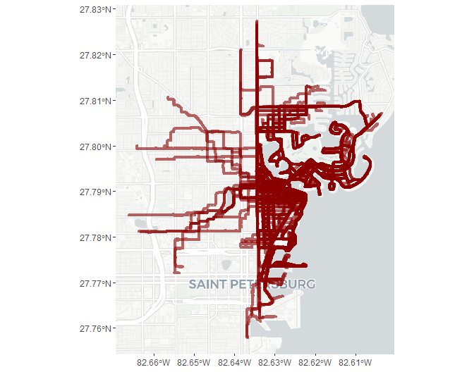
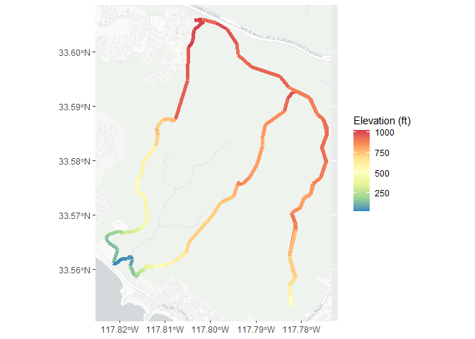
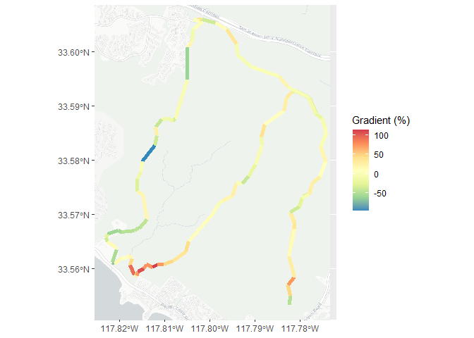
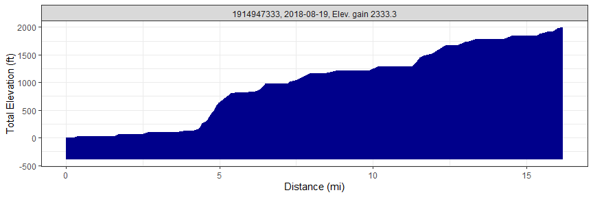
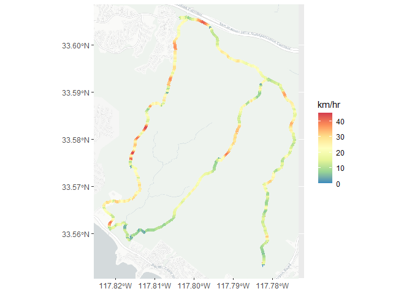
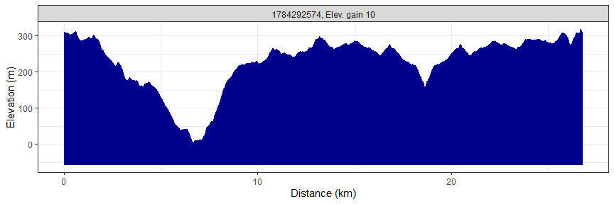

# rStrava

##### *Marcus W. Beck, <mbafs2012@gmail.com>, Pedro Villarroel, <pedrodvf@gmail.com>, Daniel Padfield, <dp323@exeter.ac.uk>, Lorenzo Gaborini, <lorenzo.gaborini@unil.ch>, Niklas von Maltzahn, <niklasvm@gmail.com>*

[](https://github.com/fawda123/rStrava/actions)
[](https://zenodo.org/badge/latestdoi/23404183)


<br></br> <br></br>

### Overview and installation

This is the development repository for rStrava, an R package to access
data from the Strava API. The package can be installed and loaded as
follows:

``` r
install.packages('devtools')
devtools::install_github('fawda123/rStrava')
```

### Issues and suggestions

Please report any issues and suggestions on the [issues
link](https://github.com/fawda123/rStrava/issues) for the repository.

### Package overview

The functions are in two categories depending on mode of use. The first
category of functions scrape data from the public Strava website and the
second category uses the API functions or relies on data from the API
functions. The second category requires an authentication token. The
help files for each category can be viewed using `help.search`:

``` r
help.search('notoken', package = 'rStrava')
help.search('token', package = 'rStrava')
```

### Scraping functions (no token)

An example using the scraping functions is below. Some users may have
privacy settings that block public access to account data.

``` r
# get athlete data 
athl_fun(2837007, trace = FALSE)
```

    ## $`2837007`
    ## $`2837007`$name
    ## [1] "Marcus Beck"
    ## 
    ## $`2837007`$location
    ## [1] "Irvine, California"
    ## 
    ## $`2837007`$units
    ## [1] "mi" "ft"
    ## 
    ## $`2837007`$monthly
    ##        month    miles hours elev_gain
    ## 1 2020-06-01 63.02319     8       258
    ## 2 2020-07-01 58.18209     8       229
    ## 3 2020-08-01 85.70946     9       280
    ## 4 2020-09-01 67.77482     9       257
    ## 5 2020-10-01 55.90228     7       199
    ## 6 2020-11-01 61.53501     8       293
    ## 7 2020-12-01 29.38278     3        80
    ## 
    ## $`2837007`$recent
    ##           id        name type startDateLocal distance elevation movingTime
    ## 1 4481298718 Evening Run  run     2020-12-16      3.2        44      25:57
    ## 2 4473443991 Evening Run  run     2020-12-14      3.2        10      26:08
    ## 3 4468636914   Lunch Run  run     2020-12-13      3.2        14      26:43
    ## 
    ## $`2837007`$achievements
    ## list()

### API functions (token)

#### Setup

These functions require a Strava account and a personal API, both of
which can be obtained on the Strava website. The user account can be
created by following instructions on the [Strava
homepage](https://www.strava.com/). After the account is created, a
personal API can be created under API tab of [profile
settings](https://www.strava.com/settings/api). The user must have an
application name (chosen by the user), client id (different from the
athlete id), and an application secret to create the authentication
token. Additional information about the personal API can be found
[here](https://strava.github.io/api/). Every API retrieval function in
the rStrava package requires an authentication token (called `stoken` in
the help documents). The following is a suggested workflow for using the
API functions with rStrava.

First, create the authentication token using your personal information
from your API. Replace the `app_name`, `app_client_id`, and `app_secret`
objects with the relevant info from your account.

``` r
app_name <- 'myappname' # chosen by user
app_client_id  <- 'myid' # an integer, assigned by Strava
app_secret <- 'xxxxxxxx' # an alphanumeric secret, assigned by Strava

# create the authentication token
stoken <- httr::config(token = strava_oauth(app_name, app_client_id, app_secret, app_scope="activity:read_all"))
```

Setting `cache = TRUE` for `strava_oauth` will create an authentication
file in the working directory. This can be used in later sessions as
follows:

``` r
stoken <- httr::config(token = readRDS('.httr-oauth')[[1]])
```

Finally, the `get_heat_map` and `get_elev_prof` functions require a key
from the Google API. Follow the instructions
[here](https://developers.google.com/maps/documentation/elevation/#api_key).
The key can be added to the R environment file for later use:

``` r
# save the key, do only once
cat("google_key=XXXXXXXXXXXXXXXXXXXXXXXXXXXXXXXXXXXXXX\n",
    file=file.path(normalizePath("~/"), ".Renviron"),
    append=TRUE)

# retrieve the key, restart R if not found
mykey <- Sys.getenv("google_key")
```

The `get_heat_map` function uses
[ggmap](https://github.com/dkahle/ggmap) to create base maps. A Google
API key is needed to use the function. This key must be registered
externally with the ggmap package using `register_google()` before
executing `get_heat_map`.

``` r
library(ggmap)
register_google(mykey)
```

#### Using the functions

The API retrieval functions are used with the token.

``` r
myinfo <- get_athlete(stoken, id = '2837007')
```

    ## Auto-refreshing stale OAuth token.

``` r
head(myinfo)
```

    ## $id
    ## [1] 2837007
    ## 
    ## $username
    ## [1] "beck_marcus"
    ## 
    ## $resource_state
    ## [1] 2
    ## 
    ## $firstname
    ## [1] "Marcus"
    ## 
    ## $lastname
    ## [1] "Beck"
    ## 
    ## $city
    ## [1] "Irvine"

An example creating a heat map of activities:

``` r
library(dplyr)

# get activities, get activities by lat/lon, distance, plot
my_acts <- get_activity_list(stoken)
act_data <- compile_activities(my_acts) %>% 
    filter(start_longitude < -86.5 & start_longitude > -88.5) %>% 
    filter(start_latitude < 31.5 & start_latitude > 30) %>% 
    filter(distance > 20)
    
get_heat_map(act_data, key = mykey, col = 'darkgreen', size = 2, distlab = F, f = 0.4)
```

<!-- -->

Plotting elevation and grade for a single ride:

``` r
# actitivy id
id <- 1784292574

# plot elevation along a single ride
get_heat_map(my_acts, id = id, alpha = 1, add_elev = T, f = 0.3, distlab = F, key = mykey, size = 2, col = 'Spectral', maptype = 'satellite', units = 'imperial')
```

<!-- -->

``` r
# plot % gradient along a single ride
get_heat_map(my_acts, id = id, alpha = 1, add_elev = T, f = 0.3,  distlab = F, as_grad = T, key = mykey, size = 2, col = 'Spectral', expand = 5, maptype = 'satellite', units = 'imperial')
```

<!-- -->

Get elevation profiles for activities:

``` r
# get activities
my_acts <- get_activity_list(stoken) 

get_elev_prof(my_acts, id = id, key = mykey, units = 'imperial')
```

<!-- -->

``` r
get_elev_prof(my_acts, id = id, key = mykey, units = 'imperial', total = T)
```

<!-- -->

Plot average speed per split (km or mile) for an activity:

``` r
# plots for most recent activity
plot_spdsplits(my_acts, stoken, id = id, units = 'imperial')
```

<!-- -->

Additional functions are provided to get “stream” information for
individual activities. Streams provide detailed information about
location, time, speed, elevation, gradient, cadence, watts, temperature,
and moving status (yes/no) for an individual activity.

Use `get_activity_streams` for detailed info about activities:

``` r
# get streams for the first activity in my_acts
strms_data <- get_activity_streams(my_acts, stoken, id = id)
```

    ## Warning: `as.tibble()` is deprecated as of tibble 2.0.0.
    ## Please use `as_tibble()` instead.
    ## The signature and semantics have changed, see `?as_tibble`.
    ## This warning is displayed once every 8 hours.
    ## Call `lifecycle::last_warnings()` to see where this warning was generated.

``` r
head(strms_data)
```

    ##   altitude distance grade_smooth      lat       lng moving time velocity_smooth
    ## 1    310.0   0.0000         -1.2 33.60582 -117.8021  FALSE    0            0.00
    ## 2    310.1   0.0034         -2.1 33.60582 -117.8021   TRUE    9            1.44
    ## 3    309.9   0.0082         -2.2 33.60581 -117.8020   TRUE   11            2.52
    ## 4    309.7   0.0141         -3.2 33.60580 -117.8020   TRUE   13            3.96
    ## 5    309.6   0.0180         -1.6 33.60580 -117.8019   TRUE   14           10.44
    ## 6    309.5   0.0223          0.0 33.60580 -117.8019   TRUE   15           11.52
    ##           id
    ## 1 1784292574
    ## 2 1784292574
    ## 3 1784292574
    ## 4 1784292574
    ## 5 1784292574
    ## 6 1784292574

Stream data can be plotted using any of the plotting functions.

``` r
# heat map
get_heat_map(strms_data, alpha = 1, filltype = 'speed', f = 0.3, size = 2, col = 'Spectral', distlab = F)
```

<!-- -->

``` r
# elevation profile
get_elev_prof(strms_data)
```

<!-- -->

``` r
# speed splits
plot_spdsplits(strms_data, stoken)
```

<!-- -->

### Contributing

Please view our [contributing](.github/CONTRIBUTING.md) guidelines for
any changes or pull requests.

### License

This package is released in the public domain under the creative commons
license
[CC0](https://tldrlegal.com/license/creative-commons-cc0-1.0-universal).
